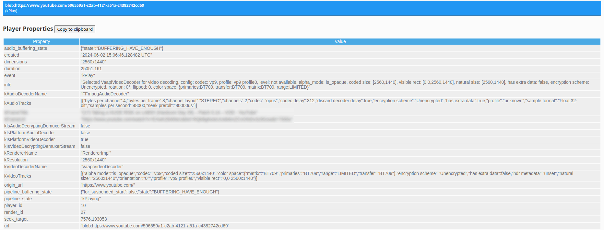

Everything started with a simple question: "Why does my laptop get hot watching YouTube?",
and led to a rabbit hole of hardware acceleration, Chrome flags, and Intel iGPUs monitors.

> Alright 44° isn't that hot, but it's the principle of the thing!

## What is Hardware Acceleration?

Even though (Intel) CPUs are general purpose processors, they include specialized hardware
and instructions to accelerate common tasks. This ranges from multi-purpose instructions
like [SSE][WikipediaSSE] for vector operations, to specialized instructions like
[AES-NI][IntelAESNI] for efficient encryption.

My system features an 11th Gen Intel i7-11800H, which includes
[Intel QuickSync][WikipediaQuickSync]: "a dedicated video encoding and decoding hardware core".
On Linux, this funcionality is exposed via [LibVA](https://github.com/intel/libva)
an implementaion of the [Video-Acceleration-API (VAAPI)](https://en.wikipedia.org/wiki/Video_Acceleration_API).

With this hardware prowess available, my laptop should be more than fine to handle a YouTube video, right?!


## Is Chrome using Hardware Acceleration?

The first step was to check if Chrome was using hardware acceleration at all.

Chrome uses `Chrome URLs` to provide (stupidly detailed) information about the browser.
For anyone looking for their next rabbit hole, you should check out [chrome://chrome-urls/](chrome://chrome-urls/).

First stop, [Chrome settings](chrome://settings)! This should let us know if hardware acceleration is enabled. Checking [chrome://settings/?search=accel](chrome://settings/?search=accel) reveals 🥁🥁🥁


Hardware acceleration is enabled!

Okay, down to the next level, as there are several features hiding behind hardware acceleration, e.g., 2D drawing, composition and video de-/encoding, maybe Chrome is just not able to accelerate video decoding. Let's continue our journey to [chrome://gpu/](chrome://gpu/).


Just to discover that video decoding **is** hardware accelerated. 🤨🤨🤨

So - any sane person might call it a day here, accept that the system runs a little warm, and move on with their life. But not me! We can go a level deeper!

Let's check out [chrome://media-internals/](chrome://media-internals/). This page is a treasure trove of information about media playback in Chrome. It shows media sessions, the codecs used, and their **hardware acceleration status**. Let's play a video and see what we can gleam from this page.


We can see that the video uses the `VP9` codec, for which our Tiger Lake CPU has [hardware support][WikipediaQuickSyncTable], but what does `kVideoDecoderName: VpxVideoDecoder` mean?

Turns out [LibVPX](https://en.wikipedia.org/wiki/Libvpx) is "the reference **software**
implementation for the VP8 and VP9 video coding formats" and there is
["no hardware encoding or acceleration support of any kind"](https://video.stackexchange.com/questions/25069/ffmpeg-hardware-acceleration-for-libvpx).

## Switch to the Video Acceleration API (VAAPI)

Armed with this knowledge we can finally start to ask the right question: "How can we make Chrome use the VAAPI hardware acceleration?"

The answer hides deep in the [Chromium Docs](https://chromium.googlesource.com/chromium/src/+/refs/heads/main/docs/gpu/vaapi.md#vaapi-on-linux): "VA-API on Linux is not supported, but it can be enabled using the flags below". Not what I wanted to hear, but what do we have to loose at this point? Let's try it!

Even though the documentation states the flags `--use-gl=angle --use-angle=gl` are required,
they had no effect for my system. The GPU configuration in [chrome://gpu/](chrome://gpu/) stayed the same.

Adding the flags `--enable-features=VaapiVideoEncoder,VaapiVideoDecodeLinuxGL` on the other hand did the trick!



## Power Consumption

What did we actuauly gain from all this? Batterie life!

To actually qunatify the difference, I measured the power consumption of my laptop
using [powerstat](https://manpages.ubuntu.com/manpages/bionic/man8/powerstat.8.html),
while watching a YouTube video (1440p 60fps) in Chrome and Firefox (as a reference).

| Setup                       | Description    |
| :-------------------------- | :------------- |
| Chrome (VAAPI) &nbsp;&nbsp; | 12.5W ± 0.49W  |
| Chrome (VPX)                | 14.6W ± 0.86W  |
| Firefox                     | 15.7W ± 1.94W  |

This reduced my power consumption by 15%! 🎉🎉🎉

## Conclusion

Use the following flags to enable VAAPI hardware acceleration in Chrome:

```
--enable-features=VaapiVideoEncoder,VaapiVideoDecodeLinuxGL
```

These if you are on **Wayland**:

```
--enable-features=VaapiVideoEncoder,VaapiVideoDecodeLinuxGL,UseOzonePlatform --ozone-platform=wayland
```

See Chrome flags in [chrome://version/](chrome://version/) to double check
that flags are actually recognized.

Use [chrome://media-internals/](chrome://media-internals/) to verify that hardware acceleration is used.

## References

[ArchLinux Forum](https://bbs.archlinux.org/viewtopic.php?id=244031) and [Wiki](https://wiki.archlinux.org/title/Hardware_video_acceleration) are amazing resources on the topic.

Use `intel_gpu_top` from [igt-gpu-tools](https://gitlab.freedesktop.org/drm/igt-gpu-tools) to
actually see the usage of your iGPU.


[IntelAESNI]: https://www.intel.com/content/www/us/en/developer/articles/technical/advanced-encryption-standard-instructions-aes-ni.html
[WikipediaSSE]: https://en.wikipedia.org/wiki/Streaming_SIMD_Extensions
[WikipediaQuickSync]: https://en.wikipedia.org/wiki/Intel_Quick_Sync_Video
[WikipediaQuickSyncTable]: https://en.wikipedia.org/wiki/Intel_Quick_Sync_Video#Hardware_decoding_and_encoding
