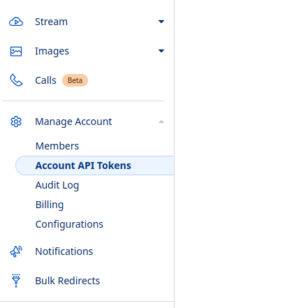
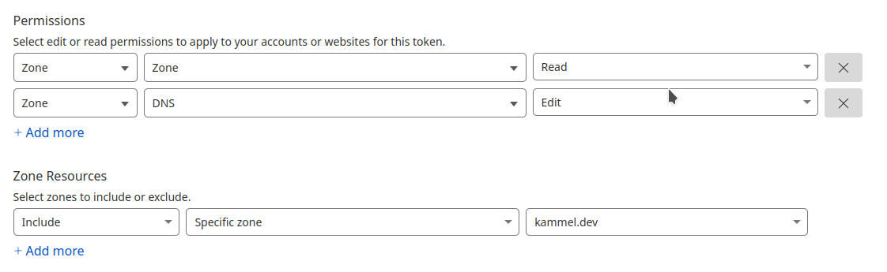

[Last time](/post/k8s_home_lab_2025_03/),
we added ingress-nginx to our cluster so that external traffic can
hit our services. In this post, we will secure that traffic using TLS.

Since I am using a `*.dev` domain, it comes with the blessing (or curse?)
of having [HSTS](https://en.wikipedia.org/wiki/HTTP_Strict_Transport_Security)
preloaded in
[most modern browsers](https://caniuse.com/stricttransportsecurity),
but even without that enforcement we want to protect all traffic using TLS.
In 2025, there’s no reason not to use TLS: it's free, easy, and fully automated.

## HTTP Strict Transport Security (HSTS)

HSTS is a security feature that tells browsers to only access your site using HTTPS.
[This mechanism works by sites sending a `Strict-Transport-Security` HTTP response header containing the site's policy](https://hstspreload.org/).
In addition, Chrome maintains a list of domains for which HSTS is enforced.
This means even before the initial response, containing the `Strict-Transport-Security`
header, is received, the browser will redirect to the HTTPS version of the site.

Some top-level domains (TLDs), such as
[.dev](https://security.googleblog.com/2017/09/broadening-hsts-to-secure-more-of-web.html),
went one step further and added the full TLD to the HSTS preload list, thereby
requiring everyone to use HTTPS when purchasing one of these domains.


This feature is only implemented in browsers, i.e., if you are using `curl` or your
favorite networking library, you are still required to properly enforce security
settings.


## Let's Encrypt

Okay, we said TLS certificates are free, but this is only because of the work
of the awesome folks at [Let's Encrypt](https://letsencrypt.org/) and their sponsors.

[Let’s Encrypt issues certificates](https://letsencrypt.org/getting-started/)
through an automated API based on the
[ACME protocol](https://en.wikipedia.org/wiki/Automatic_Certificate_Management_Environment).

How does the ACME protocol work? On a high level, a client requests a certificate
for a given domain from the CA. The CA will then send a challenge, which only the
owner of the domain can satisfy. Once the challenge is verified, the CA will issue
a certificate.

So how do we automate this process? Let's encrypt provides a list of
[ACME client implementations](https://letsencrypt.org/docs/client-options/).
[Certbot](https://certbot.eff.org/) is a popular general-purpose CLI tool,
but for Kubernetes we will use [cert-manager](https://cert-manager.io/).

## Cert-Manager

Cert-manager is implemented as a
[Kubernetes Controller](https://kubernetes.io/docs/concepts/architecture/controller/),
i.e., a piece of software that continuously watches the state of the cluster
and takes actions to bring the current state closer to the desired state.
In our case, we use cert-manager to watch our ingress resources and request
certificates, but also to renew them when they are about to expire.

In order to prove ownership of the domain, we use the
[DNS01 challenge](https://cert-manager.io/docs/configuration/acme/dns01/), which
requires us to create a TXT record in the DNS. The alternative is the
[HTTP01 challenge](https://cert-manager.io/docs/configuration/acme/http01/)
which asks you to host the answer to the challenge at a specific path on your
web server. I generally prefer the DNS01 challenge, as it does not require any
internet-facing service to be set up, but the HTTP01 challenge is useful if you
cannot control the DNS entries from your cluster!

As we said in the beginning, my domain is managed by Cloudflare. If you choose
a different provider, check the
[cert-manager docs](https://cert-manager.io/docs/configuration/acme/dns01/)
as they have documentation for many different providers, such as
[DigitalOcean](https://cert-manager.io/docs/configuration/acme/dns01/digitalocean/)
or [Route 53](https://cert-manager.io/docs/configuration/acme/dns01/route53/).

### Create API Token

To enable our cert-manager to create the required DNS records, we need to create
an API token with the necessary permissions. To do so,
[log in to your Cloudflare account](https://dash.cloudflare.com/login)
and follow these steps:

1. Access the **Account API Tokens** page
    

2. Click on **Create Token**

3. Scroll to the bottom and create a **Custom Token**

4. For permissions, select **DNS edit** and **zone read**, as well as the zone you want to manage:

    

5. Click on **Continue to Summary** and then **Create Token**

6. Copy the token and store it in a safe place, as we will need it later.

### Deployment

Awesome, now that we have our API token, we can deploy cert-manager to our cluster.

Let's follow the cert-manager docs for a
[Helm installation](https://cert-manager.io/docs/installation/helm/), and convert
it to Flux resources:

```yaml
---
apiVersion: v1
kind: Namespace
metadata:
  name: ingress-nginx
---
apiVersion: source.toolkit.fluxcd.io/v1
kind: HelmRepository
metadata:
  name: ingress-nginx
  namespace: ingress-nginx
spec:
  interval: 5m0s
  url: https://kubernetes.github.io/ingress-nginx
---
apiVersion: helm.toolkit.fluxcd.io/v2
kind: HelmRelease
metadata:
  name: ingress-nginx
  namespace: ingress-nginx
spec:
  chart:
    spec:
      chart: ingress-nginx
      reconcileStrategy: ChartVersion
      sourceRef:
        kind: HelmRepository
        name: ingress-nginx
      version: 4.12.0
  interval: 5m0s
```

Once that's deployed, we can create our issuer configuration:


```yaml
---
apiVersion: cert-manager.io/v1
kind: ClusterIssuer
metadata:
  name: letsencrypt-staging
spec:
  acme:
    server: https://acme-staging-v02.api.letsencrypt.org/directory
    email: fabian@kammel.dev
    # Name of a secret used to store the ACME account private key
    privateKeySecretRef:
      name: letsencrypt-staging
    solvers:
      - dns01:
          cloudflare:
            apiTokenSecretRef:
              name: cloudflare-api-token-secret
              key: api-token
---
apiVersion: cert-manager.io/v1
kind: ClusterIssuer
metadata:
  name: letsencrypt-prod
spec:
  acme:
    server: https://acme-v02.api.letsencrypt.org/directory
    email: fabian@kammel.dev
    # Name of a secret used to store the ACME account private key
    privateKeySecretRef:
      name: letsencrypt-prod
    solvers:
      - dns01:
          cloudflare:
            apiTokenSecretRef:
              name: cloudflare-api-token-secret
              key: api-token
```

See that both issuers reference an `apiTokenSecretRef`? Now we need the API token
we created earlier. Let's create a Kubernetes secret for it:

```bash
kubectl create secret generic cloudflare-api-token-secret \
  --namespace cert-manager \
  --from-literal=api-token=<API_TOKEN>
```

Two things to note here:

1. We created `ClusterIssuer` resources, which means they are able to fulfill
    certificate requests for any namespace in the cluster. If you want to restrict
    this, create a
    [namespace-scoped issuer](https://cert-manager.io/docs/concepts/issuer/)
    instead.
2. We created two issuers, one for staging and one for production. Let's Encrypt
    has rather strict
    [rate limits](https://letsencrypt.org/docs/rate-limits/). Make sure to use
    the staging issuer when you are still "figuring things out", or else you
    may find yourself blocked for
    [as long as a few days](https://letsencrypt.org/docs/rate-limits/#limit-2)!

### Testing

Let's use the
[kuard example deployment](/post/k8s_home_lab_2025_03/#verifying-the-setup)
from the previous post and change the ingress to
support TLS, making use of our new cert-manager issuer:

```yaml
apiVersion: networking.k8s.io/v1
kind: Ingress
metadata:
  name: kuard
  namespace: ingress-test
  annotations:
    cert-manager.io/cluster-issuer: "letsencrypt-prod"
spec:
  ingressClassName: nginx
  tls:
  - hosts:
    - test.kammel.dev
    secretName: tls-test-kammel-dev
  rules:
  - host: test.kammel.dev
    http:
      paths:
      - path: /
        pathType: Prefix
        backend:
          service:
            name: kuard
            port:
              number: 80
```

The only things we added are the `tls` section and the
`cert-manager.io/cluster-issuer` annotation.

We should see cert-manager spring into action and create both a
`CertificateRequest` and a `Certificate` resource:

```console
$ kubectl get cert -n ingress-test
NAME                  READY   SECRET                AGE
tls-test-kammel-dev   True    tls-test-kammel-dev   3m

$ kubectl get certificaterequest -n ingress-test
NAME                    APPROVED   DENIED   READY   ISSUER             REQUESTER                                         AGE
tls-test-kammel-dev-1   True                True    letsencrypt-prod   system:serviceaccount:cert-manager:cert-manager   3m
```

This time, we actually want to use the browser, so make sure to either set the
`test.kammel.dev` entry in your `/etc/hosts` file,
[like so](https://superuser.com/a/597824), or configure it in your local DNS server.
In any case, the domain should resolve locally to the public IP address of the
load balancer service used by ingress-nginx.

```console
$ kubectl get svc -n ingress-nginx
NAME            TYPE           CLUSTER-IP      EXTERNAL-IP     PORT(S)                      AGE
ingress-nginx   LoadBalancer   10.100.100.100  192.168.1.18    80:30080/TCP,443:30443/TCP   10m

$ dig +short test.kammel.dev
192.168.1.18
```

Aaaand voilà:




When you are done testing, but you want to keep the files "just in case",
create a [.sourceignore](https://fluxcd.io/flux/components/source/gitrepositories/#ignore)
file in the same folder, and Flux will remove the deployment, but you get to keep
the files.


## Conclusion

We now have a fully automated TLS setup for our ingress resources. In the next
post, we will add persistent storage, the last step, before we can actually
deploy interesting services. Stay tuned!

## Bonus: Understanding Certificate Transparency Logs

Every certificate issued by Let's Encrypt is recorded in a public
[Certificate Transparency Log](https://en.wikipedia.org/wiki/Certificate_Transparency).
So be aware that every time you request a certificate, it will be recorded, and
this information is [publicly available](https://crt.sh/).

The upside is that independent auditors can use this information, and detect
fraudulent certificates.  Also, colleagues and attackers alike will use
this information to gain insights about your infrastructure!

To mitigate this somewhat, I chose to use domains that reflect the purpose of the
service, e.g., `vod.kammel.dev` as opposed to `jellyfin.kammel.dev`, as it both
hides the actual service and is usually more memorable.
