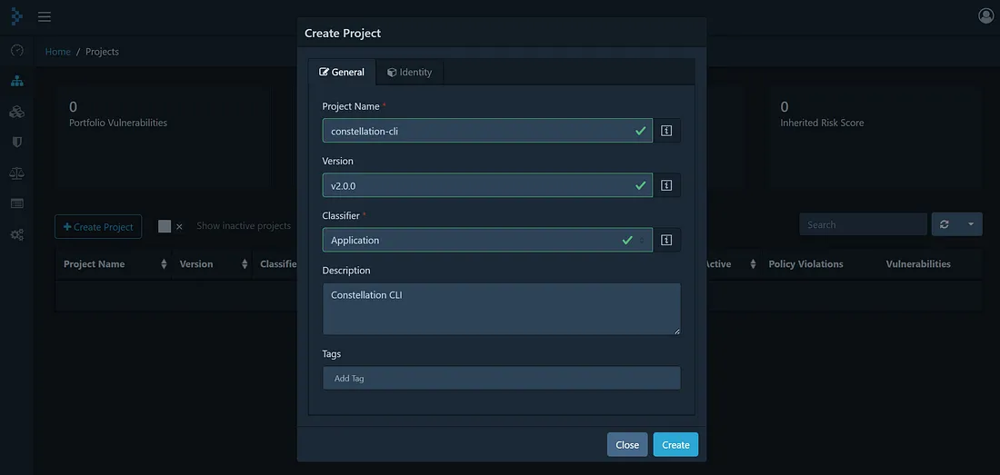
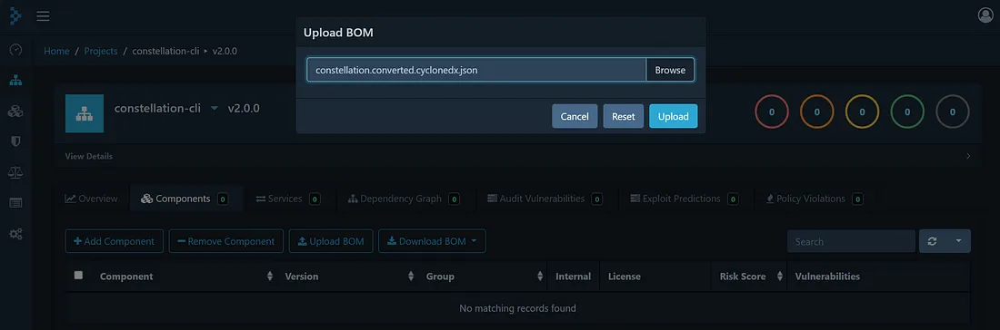
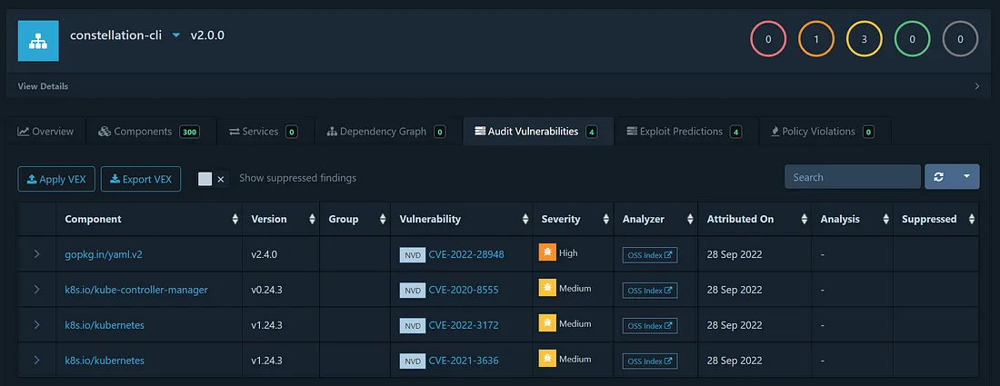

In our last post (TODO: LINK), we explored how Software Bill of Materials (SBOMs) provide us with a transparent view of all dependencies in Constellation. In this post, we explore how we can use this information to continuously monitor vulnerabilities and upgrade to patched versions as soon as they are available.

### Grype

[Grype](https://github.com/anchore/grype) is a vulnerability scanner for container images and filesystems. It supports reading SBOMs we've previously generated with Syft. Grype is great for engineers working on Constellation to get the latest vulnerability information.

```sh
$ syft . --catalogers go-mod-file --file constellation.spdx.sbom -o spdx-json
$ grype -q sbom:constellation.spdx.sbom

NAME                                  INSTALLED             FIXED-IN  TYPE       VULNERABILITY        SEVERITY
github.com/theupdateframework/go-tuf  v0.3.0                0.3.2     go-module  GHSA-3633-5h82-39pq  Low
go.etcd.io/etcd                       v3.3.27+incompatible  3.4.0     go-module  GHSA-wf43-55jj-vwq8  Medium
google.golang.org/protobuf            v1.28.0                         go-module  CVE-2015-5237        High
google.golang.org/protobuf            v1.28.0                         go-module  CVE-2021-22570       Medium
helm.sh/helm/v3                       v3.9.2                3.9.4     go-module  GHSA-7hfp-qfw3-5jxh  Medium
k8s.io/kube-proxy                     v0.24.3               1.16.11   go-module  GHSA-wqv3-8cm6-h6wg  High
```

### Dependency Track

[Dependency Track](https://dependencytrack.org/) is a mature vulnerability detection and management system. It is used by many enterprises to keep track of vulnerabilities in their used applications and helps to manage risk in a transparent manner.

Constellation makes it easy for users to get all information right into Dependency Track, using the [SBOMs we publish with each release](https://github.com/edgelesssys/constellation/releases).

Since Dependency Track only supports [CycloneDX](https://cyclonedx.org/), we need to convert the SBOM from [SPDX](https://spdx.dev/) to CyloneDX first.

```sh
syft convert constellation.spdx.sbom -o cyclonedx-json --file constellation.cyclonedx.sbom
```

Afterward, we can simply create a new project in Dependency Track and import the converted SBOM.







The first vulnerability is a false positive, where a [vulnerability for the v3 package](https://github.com/go-yaml/yaml/issues/666) is reported for the v2 version. This was [fixed in some](https://security.snyk.io/vuln/SNYK-GOLANG-GOPKGINYAMLV2-2840885), but not all vulnerability databases.

The K8s-related versions are already fixed in Constellation since we have upgraded to the K8s patch version v1.24.6.

Make sure to also import [all Constellation container images](https://github.com/orgs/edgelesssys/packages?visibility=public&tab=packages&q=constellation) into Dependency Track to get the full view!

### Conclusion

Scanning and analyzing SBOMs is essential for us and our users to stay informed about known vulnerabilities in Constellation and update as soon as possible!

Originally published on [Medium](https://medium.com/@datosh18/my-favorite-tools-to-keep-a-zero-vulnerabilities-posture-for-constellation-c3ed13d0b580).
